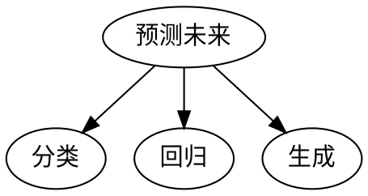
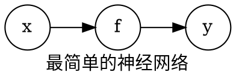
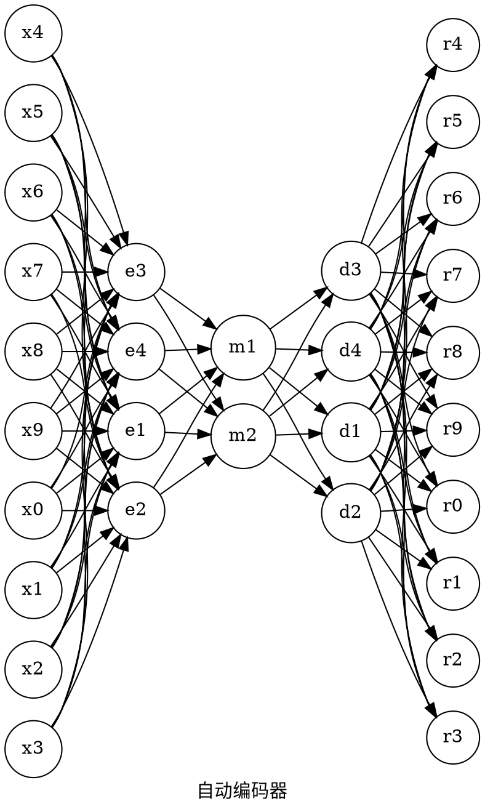
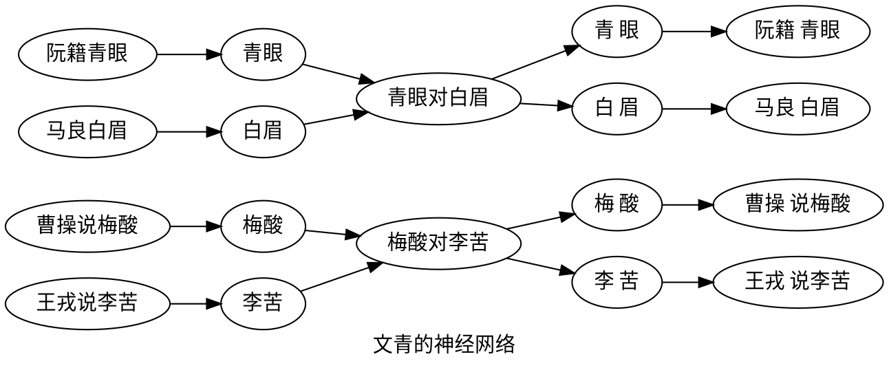

---
presentation:
  width: 1280
  height: 800
  font-family: 微软雅黑
  enableSpeakerNotes: true
---

<!-- slide -->
# 深度学习入门
> 郑东

[GitHub](http://github.com/east196)

<!-- slide -->
## 深度学习
### 是什么？
机器学习的最前沿分支
深度学习 = 深度神经网络
<!-- slide vertical=true-->
### 能做什么？
预测未来


<!-- slide vertical=true-->
### Why？
简单粗暴效果好！
能跑出来了：
越来越大的数据
越来越快的电脑
越来越多的优化技巧
能解决新的问题：
越来越多的Neural Network模型

<!-- slide vertical=true-->
### AI？
AI目前用途最广泛的分支，疯狂融合其他分支的内容
AlphaGo ~~~ DNN+蒙特卡洛搜索树
自动驾驶 ~~~ CNN
聊天机器人 ~~~ RNN
生成文本，图片，语音，视频 ~~~ GAN
自动打游戏 ~~~ DQN


<!-- slide -->
## 机器学习的分类
监督学习：分类，回归
无监督学习：聚类
强化学习：奖惩机制

<!-- slide vertical=true-->
深度学习遍及监督学习，无监督学习，强化学习的方方面面。
但最强的还是在于：
### 监督学习
分类和回归

<!-- slide -->
## 从y=wx+b谈起
$y=f(x)$
## 简单的函数
二元一次方程 - 普通的线性关系
$y=wx+b$

- 给两组数据：
10，2
3，4

- 构成方程：
$2 = 10w+ b$
$4 = 3w+b$

怎么解？：）
<!-- slide data-background-image="../assets/sklearn.jpg" vertical=true -->


<!-- slide vertical=true-->
```python {cmd=true matplotlib=true}

import numpy as np
import matplotlib.pyplot as plt
from matplotlib.font_manager import *
#指定默认字体  
matplotlib.rcParams['font.family']='simhei'  
#解决负号'-'显示为方块的问题  
matplotlib.rcParams['axes.unicode_minus']=False  

#解方程 y = wx + b
x = np.array([10,3])
y = np.array([2,4])

A = np.vstack([x, np.ones(len(x))]).T
w, b = np.linalg.lstsq(A, y)[0]
#print(w, b)

# 再来画个图
plt.axis([0, 15, 0 ,6])
plt.plot(x, y, 'o', label=u'原始数据', markersize=10)

t = np.linspace(-10,20,10)
plt.plot(t, w*t + b, 'r', label=u'线性方程')
plt.legend()
plt.show()
```


<!-- slide vertical=true-->
然而，现实是：
```python {cmd=true matplotlib=true}

import numpy as np
import matplotlib.pyplot as plt
from matplotlib.font_manager import *
#指定默认字体  
matplotlib.rcParams['font.family']='simhei'  
#解决负号'-'显示为方块的问题  
matplotlib.rcParams['axes.unicode_minus']=False  

# 模拟真实数据
x = np.linspace(-15,20,100)
y = 10*x +np.random.rand(100)*120
z = 3*x*x +np.random.rand(100)*160
m = 2*x*x +10*x +np.random.rand(100)*250

# 再来画个图
plt.plot(x, y, 'o', label=u'真实数据', markersize=10)
plt.plot(x, z, 'x', label=u'数据', markersize=10)
plt.plot(x, m, '*', label=u'数据', markersize=10)

plt.legend()
plt.show()
```
<!-- slide vertical=true-->
## 传统的机器学习方法
分类，回归，聚类
scikit-learn

<!-- slide data-background-image="../assets/sklearn.jpg" vertical=true -->


<!-- slide vertical=true-->
## 最简单的神经网络

咦，效果一般啊？
一定是打开的方式不对！

<!-- slide vertical=true-->
## 权重Weight与偏置Biase
$ y = wx+b $
面熟对不对？
求解线性问题
权重和偏置怎么设置？
我也不知道，那就随机吧...

<!-- slide vertical=true-->
## 激活函数
面对现实
非线性世界

<!-- slide vertical=true-->
激活函数 Sigmoid&Tanh
```python {cmd=true matplotlib=true}
import math  
import matplotlib.pyplot as plt  
import numpy as np  
import matplotlib as mpl  
mpl.rcParams['axes.unicode_minus']=False  


def  sigmoid(x):  
    return 1.0 / (1.0 + np.exp(-x))  

fig = plt.figure(figsize=(6,4))  
ax = fig.add_subplot(111)  

x = np.linspace(-10, 10)  
y = sigmoid(x)  
tanh = 2*sigmoid(2*x) - 1  

plt.xlim(-11,11)  
plt.ylim(-1.1,1.1)  

ax.spines['top'].set_color('none')  
ax.spines['right'].set_color('none')  

ax.xaxis.set_ticks_position('bottom')  
ax.spines['bottom'].set_position(('data',0))  
ax.set_xticks([-10,-5,0,5,10])  
ax.yaxis.set_ticks_position('left')  
ax.spines['left'].set_position(('data',0))  
ax.set_yticks([-1,-0.5,0.5,1])  

plt.plot(x,y,label="Sigmoid",color = "blue")  
plt.plot(2*x,tanh,label="Tanh", color = "red")  
plt.legend()  
plt.show()  
```
<!-- slide vertical=true-->
激活函数 ReLU
```python {cmd=true matplotlib=true}
import math  
import matplotlib.pyplot as plt  
import numpy as np  
import matplotlib as mpl  
mpl.rcParams['axes.unicode_minus']=False  

fig = plt.figure(figsize=(6,4))  
ax = fig.add_subplot(111)  

x = np.arange(-10, 10)  
y = np.where(x<0,0,x)  

plt.xlim(-11,11)  
plt.ylim(-11,11)  

ax.spines['top'].set_color('none')  
ax.spines['right'].set_color('none')  

ax.xaxis.set_ticks_position('bottom')  
ax.spines['bottom'].set_position(('data',0))  
ax.set_xticks([-10,-5,0,5,10])  
ax.yaxis.set_ticks_position('left')  
ax.spines['left'].set_position(('data',0))  
ax.set_yticks([-10,-5,5,10])  

plt.plot(x,y,label="ReLU",color = "blue")  
plt.legend()  
plt.show()  
```
<!-- slide vertical=true-->
### BP神经网络
回头修正参数

<!-- slide vertical=true-->
### 可是，我要识别一张图片，我该输入什么？
输入一般称之为特征
特征要靠自己分析，然后选取
比如我要识别车牌上的一个字

画个九宫格，9个特征
上中下，3个特征
整图，1个特征

9+3+1=13

<!-- slide vertical=true-->
NO！
现在计算机跑这么快了，
我要把 宽*高*RGBA 直接扔进去！！！

<!-- slide -->
## DNN
更大更深的神经网络

<!-- slide -->
NN打油诗
    - 郑东

机器性能大提升，
海量数据在产生。
群策群力来贡献，
神经网络大又深。

<!-- slide vertical=true-->
### 自动编码器

<!-- slide vertical=true-->
目标：保持输入和输出一致！！！
脑子秀逗了？

<!-- slide vertical=true-->
声律启蒙
梅酸对李苦，青眼对白眉
<!-- slide vertical=true-->



<!-- slide vertical=true-->
梅酸对李苦，青眼对白眉是能够复原的高度精简过的信息
同样，m1、m2 代表了全部的输入信息！！！
也就是说自动缩减了特征的维度~
带来了玩法的改变！！！

<!-- slide -->
## CNN
卷积神经网络

<!-- slide vertical=true-->
### CNN？
应用：图片识别
手电筒


<!-- slide -->
## RNN
<!-- slide vertical=true-->
### RNN
传统RNN
### LTSM

<!-- slide -->
## GAN

<!-- slide vertical=true-->
### DCGAN


<!-- slide -->
## 学习顺序
- 一本入门书：简单易懂
- 一本经典书：全面严谨
- Blog
- Github
- 论文
- 比赛
 ```dot
 digraph graph1 {
     学习->思考->行动->学习
}
 ```
<!-- slide vertical=true-->
# 学习资料
[网易云课堂的深度学习微专业by吴恩达]()

<!-- slide -->


 - <p style="color: #fff;">感谢三巨头！</p> <!-- .element: class="fragment" data-fragment-index="3" -->
 - <p style="color: #fff;">感谢吴大叔！</p> <!-- .element: class="fragment" data-fragment-index="2" -->
 - <p style="color: #fff;">感谢吴小哥！</p> <!-- .element: class="fragment" data-fragment-index="1" -->

<!-- slide data-background-image="../assets/thankyou.jpg" data-transition="zoom" -->
