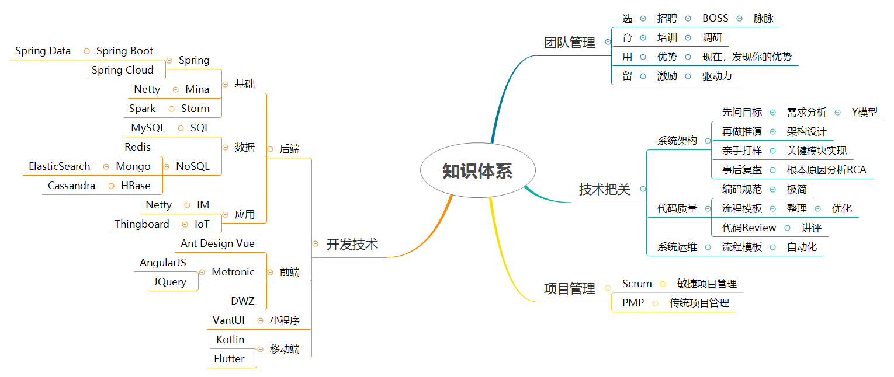

---
presentation:
  width: 1280
  height: 1080
  font-family: 微软雅黑
  enableSpeakerNotes: true
---

<!-- slide -->
# 郑东

## Java架构师/研发总监
<!-- slide vertical=true-->
## 期望薪资
35k~50k
## 联系方式
- 手机：18620385985 微信同号
- Email：2901180515@qq.com

<!-- slide vertical=true-->
## 个人信息

 - 郑东/男/1985 
 - 本科/四川大学生物医学工程 2002-2006
 - 工作年限：软件研发8年
 - 期望城市：深圳

<!-- slide vertical=true-->
## 资格证书
CMMI3 ATM证书 2013.10
PMP项目管理认证 2018.6

<!-- slide -->
## 自我评价
- 无栈思考
- 技术博客
- 敏捷高效

<!-- slide vertical=true-->
### 无栈思考
- 纵向精研Java后端架构
- 横向涉猎大前端、物联网、大数据、AI
- 化全栈为无栈
<!-- slide vertical=true-->
### 技术极客
- 注重代码整洁，重视架构设计与质量保证
- 善于重构遗留系统
- 热衷于组合与简化开发流程
<!-- slide vertical=true-->
### 敏捷高效
- 熟悉敏捷开发与敏捷管理
- 信奉少即是多
- 注重引导，能够帮助敏捷团队寻求内心的驱动力

<!-- slide vertical=true-->
## 知识体系

<!-- slide -->
## 工作经历
- 中科元景智能（深圳）有限公司
- 妙笔文化科技有限公司
- 深圳前海华视移动互联有限公司
- 风影在线有限公司
- 深圳市世纪天源环保技术有限公司

<!-- slide -->
### 中科元景智能（深圳）有限公司
#### 技术总监
<!-- slide vertical=true-->
#### 内容
1. 负责招聘并管理技术团队
2. 负责系统架构和运维管理
3. 负责关键技术攻关
<!-- slide vertical=true-->
#### 业绩
1. 从零组建产品研发团队（15人）
2. 全面主持旗下产品的研发工作并成功上线
已发布第二个大版本
- 庇虎 消防透明管理SaaS云
- 万象 面向民生安全的IoT开放平台

<!-- slide vertical=true-->
####   庇虎-消防透明管理SaaS云平台
  Leader	2018.11—2020.04
描述：面向消防行业，提供包括设备状态监测、数据分析应用的业务协同透明管理云服务，实现消防主体责任人、个人用户、消防企业、各级监管部门之间的无缝连接。
主要涉及技术为
后端技术：Spring技术栈（SpringBoot+SpringCloud） ，Mybatis，Mysql，Redis，Kafka等
前端技术：Ant Design技术栈（Ant Design Vue），Echarts ，高德地图等
移动端技术：Android，微信小程序（VantUI）

业绩：研发团队管理与培训：从零组建项目组
成功上线两个大版本

项目链接：http://www.yjupi.com/#/PihuMonitoring
<!-- slide vertical=true-->
####   万象-IoT开放平台
  Leader	2018.11—2020.04
描述：支撑庇虎的IoT平台，提供南向设备接入适配，数据存储备份，规则引擎，北向API和订阅接口。
● 针对Thingsboard进行行业深度定制开发，涉及技术主要有：Thingsboard物联网技术栈（Cassandra，Postgresql），Spring平台服务技术栈，Netty设备对接技术栈（支持TCP、UDP、HTTP、MQTT、CoAP、LWM2M等多种协议），时间序列数据库InfluxDB，Docker等

业绩：
- 支撑庇虎正常运转
- 完美接入适配10多家厂商5大类20多种消防设备

<!-- slide -->
### 妙笔文化科技有限公司
  CTO	2017.07—2018.09
内容：研发基于深度学习的自媒体数据分析平台

业绩：探索并研发：
● 自媒体数据分析平台

<!-- slide -->
### 深圳前海华视移动互联有限公司
  平台架构师	2015.09—2017.06
内容：华为，宏电在内的多家设备商数十万台设备的统一接入管理
负责WIFI和GPS信息的数据挖掘和应用

业绩：带队研发
● 公交WIFI统一设备管理平台
● 公交用户画像与房地产结合的数据应用平台
<!-- slide vertical=true-->
####   公交用户大数据分析平台
  平台架构师	2016.04—2017.06
描述：基于公司已有的数十万公交WIFI设备产生的海量数据，进行用户画像，并和交通、房地产等行业进行数据分析对接。
主要技术栈为：大数据分析栈（Spark，Storm, Kafka, HBase, ElasticSearch），Spring平台技术栈，前端AngularJs+Metronic（基于BootStrap+Jquery技术栈）。

业绩：● 公交用户精准画像：使用大数据和机器学习技术，基于现有用户数据，进行用户画像。
● 房地产行业用户推荐平台：使用大数据和和机器学习技术，基于现有用户画像，结合房地产行业数据进行用户推荐。

<!-- slide vertical=true-->
#### Wifi设备智能管理平台
  平台架构师	2015.09—2016.04
描述：提供对华为，宏电在内的多家供应商数十万台设备的接入，完成对wifi设备的管控、设备信息告警和数据分析工作。
项目使用的主要技术有Spring技术栈（spring boot，spring framework，spring mvc，spring data redis，spring data mongodb，spring data jpa+mybatis-spring）和流式大数据处理技术栈（kafka+storm）。
前端使用AngularJs+Metronic（基于BootStrap+Jquery技术栈）。

业绩：● 基于REST的设备SDK的架构实现。
● 架构WIFI新一代设备管理平台并实施。

<!-- slide -->
### 风影在线
  Java	2014.06—2015.09
内容：研发国内早期直播App 全民主播 ，任管理端主程。后期短期兼任中青宝移动社交 美不美 服务端主程。

业绩：研发：
● 主播秀场管理与数据分析后台
<!-- slide vertical=true-->
####  秀场后端系统
  Java高级工程师/Java主程	2014.07—2015.09
描述：秀场的后端业务系统分为三个部分：秀场管理服务器，内容管理服务器，聊天服务器（IM）。
项目使用的主要技术有Spring技术栈（spring，spring mvc，spring jdbc，spring data redis，spring data mongodb）和Socket NIO技术栈（mina、protobuf），RPC使用Thrift。
前端使用Metronic（基于BootStrap+Jquery技术栈）。

业绩：负责秀场内容管理与统计平台、秀场后台服务器、秀场聊天服务器的开发
● CMS：秀场内容管理和秀场用户/消费统计及相关定时任务的开发
● MS：移动端接口开发，内部接口开发，内容缓存，支付，推送/短信/邮件
● IM：聊天服务器，和MS/CMS的RPC交互

<!-- slide -->
### 深圳市世纪天源环保技术有限公司
  Java | 研发部	2012.09—2014.06
内容：从软件工程师到TeamLeader，主持研发了污染源在线监测系统（湖南湘潭落地）和移动执法系统（山西晋中落地），

业绩：负责公司研发关键问题的处理，同时
● 招聘培养近十人的技术团队。
● 作为ATM小组成员和主要负责人之一保证公司通过CMMI3认证。
<!-- slide vertical=true-->
####  环境监察移动执法
  Team Leader	2013.05—2014.06
描述：环境监察移动执法系统是面向环保局的大型系统平台，由数据支撑平台、业务协同系统、手机客户端、笔记本客户端、门户网站五大部分组成。
项目使用Spring技术栈（spring+spring mvc+spring data jpa）开发，手机通信使用MQTT，前端框架DWZ。

业绩：● 完成项目的系统架构和项目管理工作。
● 完成项目通用模块（安全、权限、缓存等）的优化工作。
● 完成数据支撑平台和手机端,笔记本端的接口设计实现。

<!-- slide vertical=true-->
#### 污染源工况过程监控系统
  Team Leader	2012.07—2013.07
描述：污染源工况过程监控系统是基于污染源工况过程监测数据的管理与统计分析平台。
项目使用轻量级JavaEE技术栈SSH（spring+struts2+hibernate）开发，前端框架DWZ。

业绩：● 完成项目后期的系统架构优化和项目管理工作。
● 完成项目模块：工况统计，工况分析，数据判定的核心代码编写。
● 完成项目数据判定神经网络算法的实现与优化。

 
<!-- slide -->
## 致谢
感谢您花时间阅读我的简历，期待能有机会和您共事。
